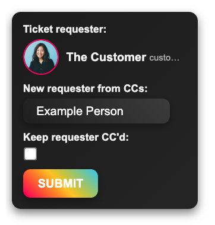
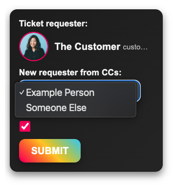

# Requester Reassigner (reCCuester)

Requester Reassigner (ReCCuester) is a Zendesk app that allows agents to reassign a ticket’s requester to an existing collaborator while preserving collaboration context.

It was built to address a common support workflow problem: correcting incorrectly assigned requesters without losing visibility or collaborators on the ticket.

---

## What the App Does

The app displays the current requester and allows agents to select a new requester from the ticket’s existing collaborators.

On submission, it:
- Updates the ticket requester
- Optionally retains the original requester as a collaborator
- Preserves all remaining collaborators
- Performs the update safely using the Zendesk API

---

## Features

### Requester Overview
- Displays the current requester’s:
  - Avatar
  - Name
  - Email
- Provides immediate context before making changes

### Collaborator Selection
- Lists existing collaborators as valid requester candidates
- Prevents selecting invalid or unrelated users
- Handles empty collaborator lists gracefully

### Safe Reassignment Logic
- Removes the new requester from collaborators (to avoid duplication)
- Optionally retains the original requester as a collaborator
- Preserves all other collaborators automatically

### Reliable Updates
- Uses the Zendesk Tickets API to update requester and collaborators
- Includes retry logic for transient API failures
- Provides clear success and error notifications to agents

---

## Displayed Information

The app UI displays:
- Current requester details
- A dropdown list of existing collaborators
- A checkbox to retain the original requester as a collaborator
- A submit action to apply changes

---

## Example Workflow

1. Ticket requester is incorrectly assigned
2. Agent looks to the Requester Reassigner app
3. Selects the correct requester from collaborators
4. Optionally keeps the original requester CC’d
5. Submits the change
6. Ticket updates without losing collaboration context

---

## Technical Overview

- **Platform:** Zendesk App Framework (ZAF)
- **Language:** JavaScript
- **API Usage:**
  - `GET /api/v2/tickets/{id}.json`
  - `PUT /api/v2/tickets/{id}.json`
- **Events:**
  - Runs on app load
  - Triggered by user interaction
- **UI Behavior:**
  - Dynamically populated collaborator list
  - Resizes automatically within the Zendesk sidebar

---

## Installation & Usage

1. Install the app in Zendesk
2. Open any ticket
3. Launch the app from the sidebar
4. Select a new requester from collaborators
5. Choose whether to keep the original requester CC’d
6. Submit to apply changes

---

## Intended Use

This app is designed for support teams that frequently need to correct ticket requesters while maintaining collaboration history and visibility.

It is generic and reusable across Zendesk environments where requester reassignment is required.

---

## Screenshots

### Default View
Displays the current ticket requester along with controls for selecting a new requester from existing collaborators.

---

### Collaborator Selection
Restricts requester reassignment to existing collaborators, preventing invalid or unintended updates.

---

## Development Notes

- Collaborator lists are captured on initial load
- Duplicate collaborator entries are prevented
- Retry logic handles transient API failures gracefully
- Defensive checks prevent invalid updates

---

## Author

Built by **Mike Lofgren**
